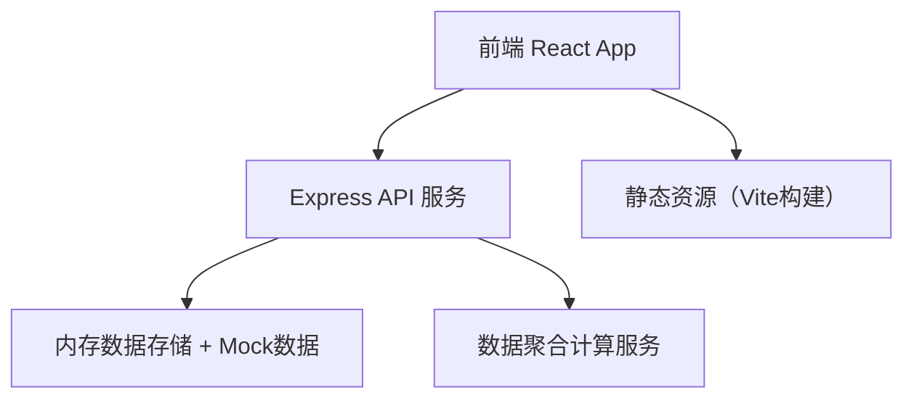
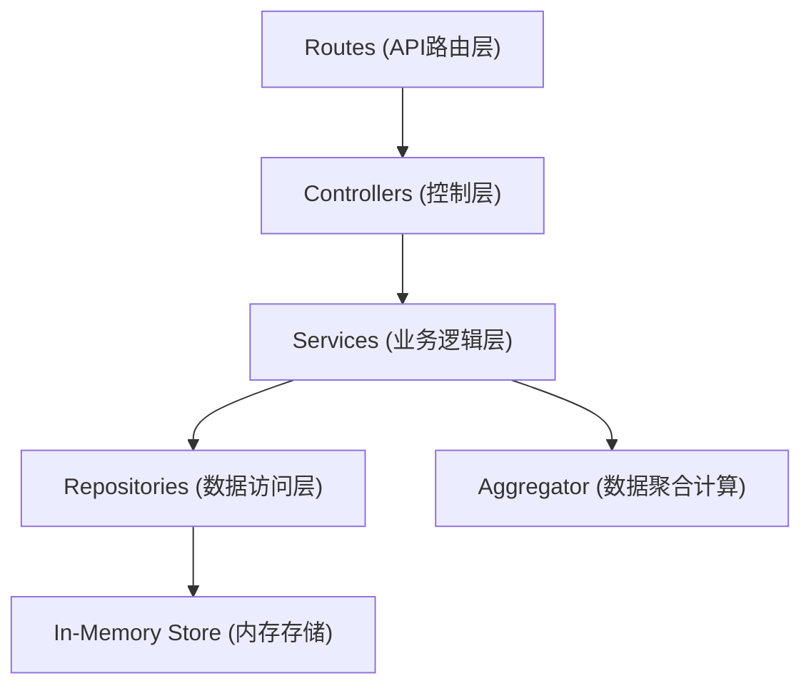
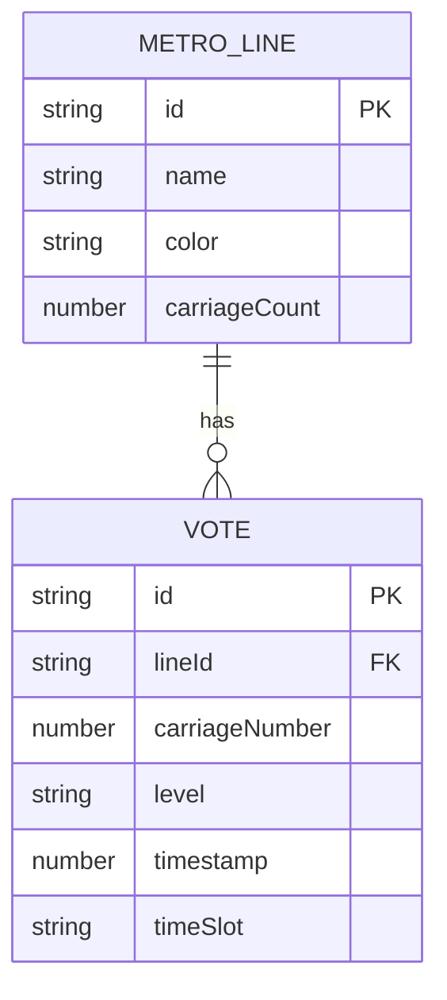

## 1. 架构设计



## 2. 技术描述
- **前端**：React@18 + TypeScript + TailwindCSS@3 + Zustand状态管理 + React Router DOM
- **前端图表**：Recharts（趋势图） + 自定义热力图组件
- **初始化工具**：vite-init（react-express-ts模板）
- **后端**：Express@4 + TypeScript（ESM格式）
- **数据存储**：服务器内存存储（含Mock初始数据），无需外部数据库
- **图标库**：lucide-react

## 3. 路由定义
| 路由 | 用途 |
|------|------|
| / | 投票主页 - 线路/车厢选择+体感投票 |
| /heatmap | 热力图页面 - 数据可视化展示 |

## 4. API 定义

### 4.1 TypeScript 类型定义
```typescript
// 体感等级
type VoteLevel = 'cold' | 'comfortable' | 'hot';

// 线路信息
interface MetroLine {
  id: string;
  name: string;
  color: string;
  carriageCount: number;
}

// 单次投票
interface Vote {
  id: string;
  lineId: string;
  carriageNumber: number;
  level: VoteLevel;
  timestamp: number;
  timeSlot: TimeSlot;
}

// 时段类型
type TimeSlot = 'morning' | 'evening' | 'offpeak' | 'all';

// 车厢聚合数据
interface CarriageStats {
  carriageNumber: number;
  coldCount: number;
  comfortableCount: number;
  hotCount: number;
  totalCount: number;
  temperatureScore: number; // -100(最冷) ~ 100(最热)
}

// 线路聚合数据
interface LineStats {
  lineId: string;
  timeSlot: TimeSlot;
  carriages: CarriageStats[];
  totalVotes: number;
  coldestCarriage: number;
  hottestCarriage: number;
  comfortRate: number;
}

// 时段趋势数据
interface TrendData {
  hour: number;
  coldCount: number;
  comfortableCount: number;
  hotCount: number;
}
```

### 4.2 API 接口

#### 获取所有线路
```
GET /api/lines
Response: MetroLine[]
```

#### 提交投票
```
POST /api/votes
Request Body:
{
  lineId: string;
  carriageNumber: number;
  level: 'cold' | 'comfortable' | 'hot';
}
Response: { success: boolean; vote: Vote }
```

#### 获取线路热力图数据
```
GET /api/stats/:lineId?timeSlot=morning|evening|offpeak|all
Response: LineStats
```

#### 获取时段趋势数据
```
GET /api/trend/:lineId
Response: TrendData[]
```

## 5. 后端分层架构



## 6. 数据模型

### 6.1 数据模型ER图



### 6.2 初始Mock数据

预置北京市主要地铁线路数据（1号线、2号线、5号线、10号线、13号线等），每条线路预生成100-300条随机历史投票数据，覆盖早高峰（7-9点）、晚高峰（17-19点）、平峰时段，确保热力图展示效果。
