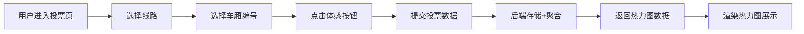

## 1. 产品概述
地铁车厢空调体感投票平台，是面向地铁通勤族的车厢温度吐槽与数据可视化工具。用户在乘车时可快速提交体感投票，平台聚合数据后以热力图直观展示各线路、各时段、各车厢的空调温度分布。
- 解决地铁通勤时"冻僵/闷热"的温度不适问题，让乘客提前选择舒适车厢
- 通过众包数据积累，形成城市地铁空调温度的开放数据集

## 2. 核心功能

### 2.1 用户角色
| 角色 | 注册方式 | 核心权限 |
|------|----------|----------|
| 普通用户 | 无需注册，匿名使用 | 提交体感投票、查看热力图、浏览统计数据 |

### 2.2 功能模块
1. **投票页面**：线路选择器、车厢编号选择器、三档体感投票按钮（冻僵/刚好/闷热）
2. **热力图页面**：线路切换、时段筛选、车厢热力图可视化、数据统计概览
3. **数据统计**：各线路温度分布、高峰/平峰时段对比、历史趋势

### 2.3 页面详情
| 页面名称 | 模块名称 | 功能描述 |
|----------|----------|----------|
| 投票页面 | 线路选择器 | 下拉选择当前乘坐的地铁线路（含线路名称+颜色标识） |
| 投票页面 | 车厢选择器 | 可视化选择车厢编号（1-8节，类似列车编组图示） |
| 投票页面 | 体感投票 | 三个大按钮：🥶冻僵 / 😐刚好 / 🥵闷热，点击即提交 |
| 投票页面 | 提交反馈 | 投票成功后显示感谢动画，可跳转查看热力图 |
| 热力图页面 | 线路切换栏 | 顶部横向滚动选择不同线路 |
| 热力图页面 | 时段筛选 | 可切换查看当前/早高峰/晚高峰/全天数据 |
| 热力图页面 | 车厢热力图 | 列车编组图形式展示，颜色从蓝色（冷）到红色（热）渐变 |
| 热力图页面 | 数据统计卡 | 显示投票总数、最冷车厢、最闷车厢、舒适率等关键指标 |
| 热力图页面 | 趋势图表 | 展示当日各时段温度变化趋势 |

## 3. 核心流程
用户打开页面 → 选择所在线路 → 选择车厢编号 → 点击体感按钮提交投票 → 查看实时热力图反馈
平台后端按线路+时段+车厢聚合投票数据 → 前端拉取聚合数据 → 渲染热力图与统计指标

## 4. 用户界面设计

### 4.1 设计风格
- **主色调**：地铁蓝（#1E88E5）作为品牌主色，搭配冷色调蓝（#42A5F5）和暖色调红（#EF5350）表示温度两极
- **辅助色**：舒适绿（#66BB6A）表示"刚好"，深灰（#37474F）为中性底色
- **按钮风格**：大尺寸圆角胶囊按钮，带有微妙阴影和按压动效
- **字体**：标题使用"Space Grotesk"或"Chakra Petch"等具有科技感的几何字体，正文使用"Noto Sans SC"
- **布局风格**：深色工业风背景，卡片式布局，信息密度适中
- **图标风格**：使用Lucide图标库，搭配Emoji表情增强体感表达

### 4.2 页面设计概述
| 页面名称 | 模块名称 | UI元素 |
|----------|----------|--------|
| 投票页面 | 头部 | Logo+标语，深色渐变背景，地铁列车剪影装饰 |
| 投票页面 | 线路选择 | 彩色圆形线路标识+名称，下拉选择 |
| 投票页面 | 车厢选择 | 横向列车编组图，选中车厢高亮放大 |
| 投票页面 | 投票按钮 | 三个超大Emoji按钮，悬浮有缩放效果，点击有粒子动画 |
| 热力图页面 | 顶部导航 | 线路Tab横向滚动，选中线路颜色高亮 |
| 热力图页面 | 时段筛选 | Pill形状切换按钮组 |
| 热力图页面 | 热力图主体 | 列车俯视示意图，每节车厢背景色按温度渐变填充，显示投票数 |
| 热力图页面 | 统计卡片 | 四个小卡片展示核心指标，数字有渐变效果 |
| 热力图页面 | 趋势图 | 简洁折线图或面积图，冷/暖双色叠加 |

### 4.3 响应式设计
- 桌面端优先设计，移动端自适应
- 投票按钮在移动端改为纵向排列，保持可点击区域足够大
- 热力图在移动端允许横向滚动查看整列车
- 触摸操作优化：按钮最小尺寸48px，消除误触

### 4.4 动画与微交互
- 页面加载：元素依次淡入+轻微上移（staggered reveal）
- 投票按钮：hover时缩放1.05，点击时粒子爆炸效果
- 热力图：颜色渐变过渡动画，数据更新时数字滚动效果
- 车厢选择：选中时弹跳动画，未选中时轻微呼吸效果
